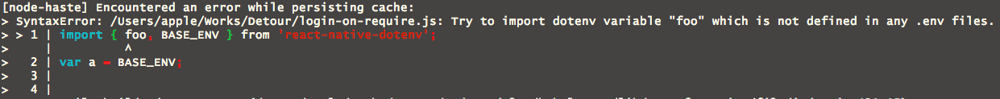

# react-native-dotenv

Let you `import` environment variables from a **.env** file in React Native, **don't** need any native code integration.

## Install

```sh
$ npm install react-native-dotenv --save-dev
```

If you haven't got **.babelrc** set up for React Native, run

```sh
$ npm install babel-preset-react-native --save-dev
```

And create a file named **.babelrc** as follow in the project root.

```json
{
  "presets": ["react-native", "react-native-dotenv"]
}
```

## Usage

Add app configuration in the **.env** file.

```
API_KEY=lorem
ANOTHER_CONFIG=foobar
```

And import it in your **.js** file.

```js
import { API_KEY, ANOTHER_CONFIG } from 'react-native-dotenv'

ApiClient.init(API_KEY, ANOTHER_CONFIG)
```

## How it works?

As you can see, it's a babel plugin. It replaces referenced imported members as the values specified in the **.env** file. So the above example will get compiled as below,

```js

ApiClient.init('lorem', 'foobar')
```

## What we got?

* It could find out error like importing an non-existing variable.



* Zero native integration required. (compared to [react-native-config](https://github.com/luggit/react-native-config))
* Since beneath, we use the current [dotenv](https://www.npmjs.com/package/dotenv) package, so the same **.env** file could be reused in nodejs environment.

## Contact

[David Chang](http://github.com/zetachang)
[@zetachang](https://twitter.com/zetachang)

## LICENSE

MIT License, see LICENSE file for detail.
